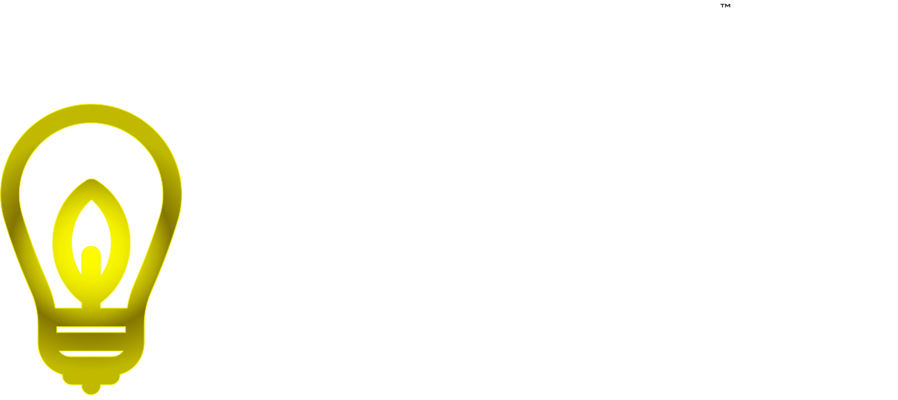

# id8 - Quick Idea Tracking

<p align="center">
  
</p>

<p align="center">
  <strong>Capture ideas. Iterate. Collaborate.</strong>
</p>

<p align="center">
  A mobile-first React Native app for quick idea tracking with threaded discussions and team collaboration.
</p>

---

## Features

- **Quick Idea Capture** - Instantly save your ideas with a single tap
- **Threaded Discussions** - Iterate on ideas with reply threads
- **File Attachments** - Attach images and documents to ideas and replies
- **Collaboration** - Invite team members to contribute to your ideas
- **Archive & Delete** - Keep your idea list clean by archiving completed ideas
- **Glassmorphic UI** - Beautiful glass-effect design with smooth animations
- **Dark/Light Mode** - Choose your preferred theme
- **Custom Backgrounds** - Personalize with your own images or videos

## Tech Stack

### Mobile App
- React Native with Expo
- React Navigation
- Expo Auth Session (Google OAuth)
- Expo Image Picker & Document Picker
- React Native Reanimated (animations)
- Expo Blur (glassmorphic effects)

### Backend
- Node.js + Express
- PostgreSQL
- AWS S3 (file storage)
- JWT Authentication
- Google OAuth 2.0

## Getting Started

### Prerequisites

- Node.js 18+
- PostgreSQL 15+
- AWS S3 bucket
- Google Cloud Console project with OAuth credentials
- Expo CLI (`npm install -g expo-cli`)

### Installation

1. **Clone the repository**
   ```bash
   git clone https://github.com/unobtuse/unobtuse-id8.git
   cd unobtuse-id8
   ```

2. **Set up the database**
   ```bash
   # Create PostgreSQL database
   createdb id8
   
   # Run the schema (see docs/database-schema.sql)
   psql -d id8 -f docs/database-schema.sql
   ```

3. **Configure the backend**
   ```bash
   cd backend
   cp .env.example .env
   # Edit .env with your credentials
   npm install
   npm start
   ```

4. **Configure the mobile app**
   ```bash
   cd mobile
   cp .env.example .env
   # Edit .env with your API URL and Google Client ID
   npm install
   expo start
   ```

### Environment Variables

#### Backend (.env)
| Variable | Description |
|----------|-------------|
| `PORT` | Server port (default: 3001) |
| `DB_HOST` | PostgreSQL host |
| `DB_PORT` | PostgreSQL port |
| `DB_NAME` | Database name |
| `DB_USER` | Database user |
| `DB_PASSWORD` | Database password |
| `JWT_SECRET` | Secret for JWT signing |
| `GOOGLE_CLIENT_ID` | Google OAuth client ID |
| `GOOGLE_CLIENT_SECRET` | Google OAuth client secret |
| `AWS_ACCESS_KEY_ID` | AWS access key |
| `AWS_SECRET_ACCESS_KEY` | AWS secret key |
| `AWS_REGION` | AWS region |
| `AWS_BUCKET` | S3 bucket name |

#### Mobile (.env)
| Variable | Description |
|----------|-------------|
| `API_URL` | Backend API URL |
| `GOOGLE_CLIENT_ID` | Google OAuth client ID |

## API Endpoints

### Authentication
- `POST /api/auth/google` - Google OAuth login
- `GET /api/auth/me` - Get current user

### Ideas
- `GET /api/ideas` - List ideas
- `GET /api/ideas/:id` - Get idea details
- `POST /api/ideas` - Create idea
- `PUT /api/ideas/:id` - Update idea
- `PATCH /api/ideas/:id/archive` - Archive/unarchive idea
- `DELETE /api/ideas/:id` - Delete archived idea

### Replies
- `GET /api/replies/idea/:ideaId` - Get replies for idea
- `POST /api/replies` - Create reply
- `PUT /api/replies/:id` - Update reply
- `DELETE /api/replies/:id` - Delete reply

### Attachments
- `POST /api/attachments/upload` - Upload file
- `GET /api/attachments/idea/:ideaId` - Get attachments
- `DELETE /api/attachments/:id` - Delete attachment

### Collaborators
- `GET /api/collaborators/idea/:ideaId` - List collaborators
- `POST /api/collaborators/invite` - Invite collaborator
- `GET /api/collaborators/invitations` - Get pending invitations
- `PATCH /api/collaborators/:id/respond` - Accept/reject invitation
- `DELETE /api/collaborators/:id` - Remove collaborator

### Settings
- `GET /api/settings` - Get user settings
- `PATCH /api/settings/theme` - Update theme
- `POST /api/settings/background` - Upload background
- `DELETE /api/settings/background` - Remove background

## Design

id8 uses a glassmorphic design language with:
- **Colors**: Monochromatic (white/black shades only)
- **Accent**: Bright yellow (#FFD600) - inspired by a lightbulb
- **Effects**: Blur, transparency, subtle borders
- **Animations**: Smooth spring-based transitions

## Deployment

See [docs/DEPLOYMENT.md](docs/DEPLOYMENT.md) for detailed deployment instructions.

## Contributing

Contributions are welcome! Please feel free to submit a Pull Request.

## License

MIT License - see [LICENSE](LICENSE) for details.

---

<p align="center">
  Made with 💡 by <a href="https://github.com/unobtuse">Unobtuse</a>
</p>
